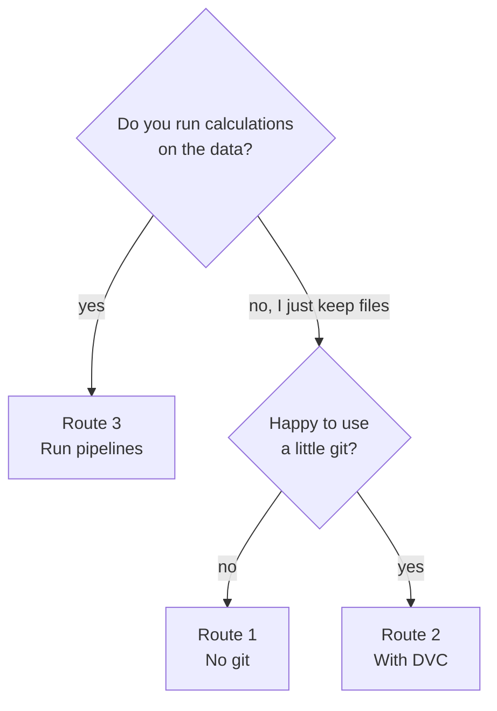

# Data Version Control for financial projects

A step-by-step tutorial on keeping your data versioned and your results reproducible: from simply
saving versions of Excel and CSV files, to full risk and rating pipelines with DVC.

## Why data version control matters

In finance, a number is only as good as your ability to explain where it came from.

Without version control, most teams end up with a folder like this:

```
client-portfolio.xlsx
client-portfolio_v2.xlsx
client-portfolio_v2_final.xlsx
client-portfolio_v2_final_JM.xlsx
client-portfolio_FINAL_use_this_one.xlsx
```

Nobody is sure which file fed last quarter's report, who changed what, or whether "final" is
really final. And sooner or later, someone asks a question like these:

- A client asks why a company's climate rating dropped from C to D between two releases.
  Was it new emissions data, a new carbon price, or a code change?
- An auditor asks to see the exact inputs behind the figures published in March.
- A colleague's results differ from yours. Are you using the same version of the market data?
- A calculation takes hours. You changed one setting. Do you really need to rerun everything?

Without version control, each question means hours of detective work, and sometimes there is no
answer at all, because the data behind a result was overwritten long ago.

**Data version control fixes this.** It gives you:

- **Every version, kept safely**, with who saved it, when, and a message saying why.
- **Any old version back** in one command, even years later.
- **One shared truth**: everyone works from the same version of the data.
- **Results you can rebuild exactly**, because each result is linked to the data, code and
  settings that produced it.
- **Less waiting**: when something changes, only the calculations it affects are rerun.

The first three matter to everyone who handles files. The last two matter when you run
calculations.

**Why not just git?** git does all this for code, but it's built for small text files. Financial
data is often gigabytes of Excel, CSV and Parquet files, and git becomes very slow, or refuses,
with files that size. **DVC** (Data Version Control) fills that gap: it gives data the same history
that git gives code. For people who don't want to use git at all, a small Python package called
**pins** does the basics.

This tutorial shows how to get there, from the simplest way to the most complete one.

## Choose your route

There are three routes, from the simplest to the most complete. Pick the one that fits your work.
You can always switch later.

### Route 1: Save file versions, no git

- **For you if** you want to keep versions of files, and you'd rather write a few lines of Python
  than learn git.
- **You'll learn** to save a file, see its history and get any old version back, with a package
  called pins.
- **Time:** about 45 minutes.

**[Start Route 1 →](docs/route-1-save-files-no-git.md)**

### Route 2: Save file versions with DVC

- **For you if** you want to keep versions of files and don't mind a little git. No coding needed.
- **You'll learn** four everyday tasks, and a script that saves a new version in one command.
- **Time:** about 1 hour, or 30 minutes if you're good at git.

**[Start Route 2 →](docs/route-2-save-files-with-dvc.md)**

### Route 3: Run pipelines

- **For you if** you run calculations on data, such as risk models, ratings or scenario analysis,
  and you want results you can rebuild exactly, months later.
- **You'll learn** DVC pipelines: first on a practice project, then in your own repository.
- **Time:** about 4 hours, or 2 hours if you're good at git.

**[Start Route 3 →](docs/route-3-1-how-dvc-works.md)**

### Not sure?



Every route starts with a few [setup steps](docs/setup.md); the route tells you which ones.
**New to git?** Before Route 2 or 3, read [Git and uv basics](docs/git-and-uv-basics.md). It takes
15 minutes. "Good at git" means you clone, commit, branch and open pull requests without thinking
about it; if that's you, skip it.

## Reference pages

- [Set up your computer](docs/setup.md)
- [Git and uv basics](docs/git-and-uv-basics.md)
- [When something goes wrong](docs/troubleshooting.md)
- [Cheat sheet](docs/cheat-sheet.md)
- [Glossary](docs/glossary.md)
- Files to copy: the [practice project](practice-project/) and the [templates](templates/)

## Conventions

- Commands are for **Windows and PowerShell**. (On a Mac or Linux almost everything is the same.
  The two differences: activate environments with `source .venv/bin/activate`, and end continued
  lines with `\` instead of a backtick.)
- Lines starting with `#` are comments: you don't type them.
- Text in angle brackets, like `<commit-id>`, is a placeholder: replace it, brackets included.
- Boxes marked **Good at git** or **New to git** tell you what to skip or read closely.

---

*Questions or corrections: open an issue or a pull request on this repository.*
