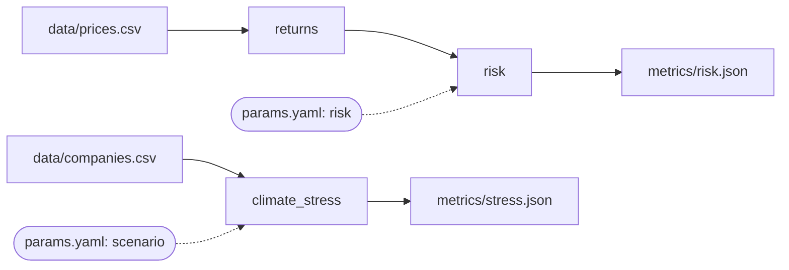

# Practice project: a small portfolio risk pipeline

This folder is the starting point for [the practice project page](../docs/2-practice-project.md).
It is safe to break: everything runs on your laptop, with made-up data and no credentials.

| File | What it does |
|---|---|
| `make_data.py` | Creates the input data (stands in for a real download). `--update` makes a refreshed version. |
| `returns.py` | Stage 1: prices → daily returns |
| `risk.py` | Stage 2: returns → portfolio Value at Risk (reads the `risk` settings) |
| `climate_stress.py` | Stage 3: carbon-price stress test on company profits (reads the `scenario` settings) |
| `params.yaml` | The settings DVC watches |
| `pyproject.toml` | Python packages needed |
| `uv.lock` | The exact version of each package, written by uv |
| `.gitattributes` | Stops git on Windows from changing the metrics files, so a fresh clone matches `dvc.lock` |

The pipeline looks like this once you have built it:

Copy this folder to `C:\dvc-practice` before you start (outside the company repositories and
outside OneDrive), then follow the tutorial.
